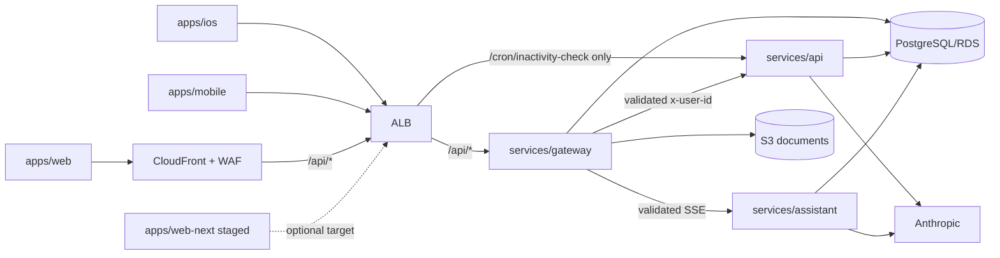

# Current Pattadar System Map

Verified from repository source/config on 2026-09-16. This is declared
architecture, not proof of applied AWS state.

## Client and service roles

- `apps/web`: shipping React/MUI/Vite SPA with public/auth/legal pages, active
  W360 app, public share/work portals, account data, assistant panel, and a
  retained `/legacy` shell.
- `apps/ios`: active SwiftUI/PattadarKit client; parity through vectors/contracts.
- `apps/mobile`: implemented Expo Router compatibility client; generated
  `ios/`/`android/` trees are not source.
- `apps/web-next`: substantial staged Next client; deploy refuses it until
  repaired parity/cutover review.
- `packages/core`: TypeScript API/network/domain/format/export logic.
- `packages/tokens`: shared web/mobile design tokens (runtime mobile imports
  should be verified when relevant).
- `services/gateway`: public JWT boundary, immutable-principal mapping, storage,
  capabilities/account/admin routes, buffered API proxy, streaming assistant proxy.
- `services/api`: FastAPI + Strawberry product/W360 domains; trusts gateway
  `x-user-id`; cron is the single ALB-routed exception protected by `CRON_SECRET`.
- `services/assistant`: authenticated SSE chat, durable conversation/run state,
  bounded tools, owner-scoped attachments, optional read-only public records.

## Main request topology

## Persistent/runtime split

Persistent: KMS, S3 documents/logs, ECR, Secrets Manager, Cognito, DNS/SES,
CloudTrail/Config/GuardDuty, GitHub OIDC. Runtime: VPC/public subnets (no NAT),
ALB, ECS gateway/api/assistant/optional web, non-public RDS, CloudFront/WAF/SPA,
scheduler, logs/alarms/SNS. Runtime reads persistent outputs through remote
state and is recreated by reviewed lifecycle scripts.

## Feature domains

Auth/identity; public/auth/legal routes; portfolio/record 360; legacy land
records; families/groups/beneficiaries; vault/storage/reader; durable AI import;
maps/FMB/village/reference ingestion; photos/features; services/orders/tickets;
associate desk; wallet/payments; scoped shares/capabilities; assistant/model
catalog; notifications/cron; account consent/export/erasure; reference data,
fees, and audit.

## Invariants

Gateway-derived identity; one secret-guarded direct cron path; immutable
issuer/subject identity; durable non-replayed AI work; server-side authority;
scoped public tokens; verbatim storage keys; persistent/runtime separation;
exact-revision release; additive compatibility; DD/MM/YYYY; implemented is not
deployed.
