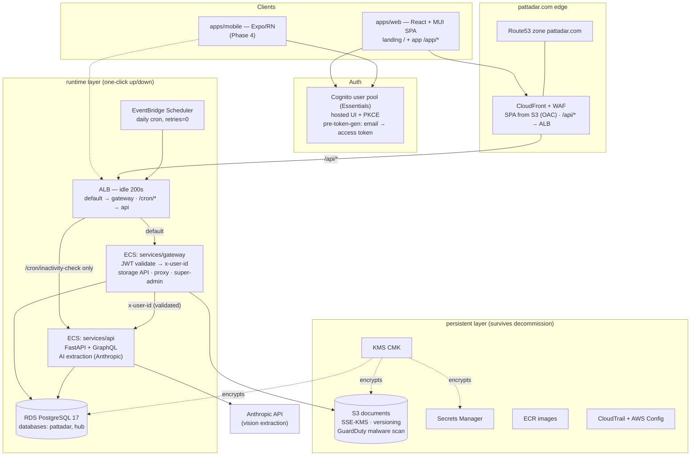
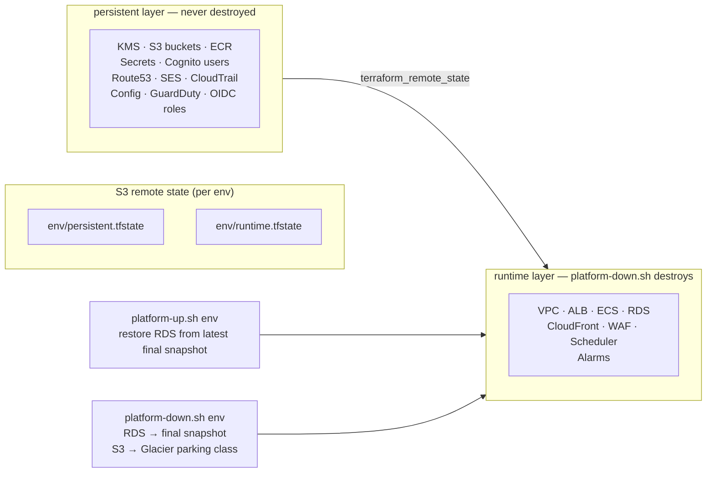
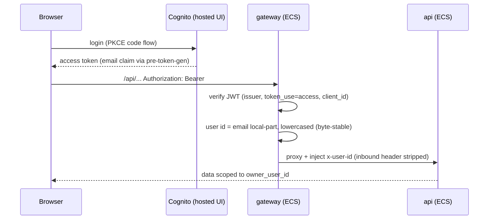

# Architecture

Live AWS architecture (ap-south-1) as deployed by `infra/terraform`. GitHub renders these diagrams inline.

## Platform

**Invariant made structural:** `services/api` trusts `x-user-id`, so its security group accepts traffic only from the gateway (plus the single ALB-routed `/cron/*` path, guarded by `CRON_SECRET`). It is never directly internet-reachable.

## Terraform layers & one-click lifecycle

Decommission parks documents (Deep Archive by default, `GLACIER_IR` for fast thaw), snapshots the database, and keeps users, keys, images, and DNS intact — `platform-up.sh` rebuilds runtime from those survivors.

## Auth flow

## Governance & visibility

- **Resource Groups** `pattadar-prod` / `pattadar-dev` — tag-based live inventory (console).
- **AWS Config** — resource relationships + change timeline (SOC 2 evidence).
- **Cloud Custodian** — daily report-only sweeps ([governance/custodian](../governance/custodian/README.md)); security findings fail the workflow.
- **CloudTrail** — all management events, 400-day retention.
