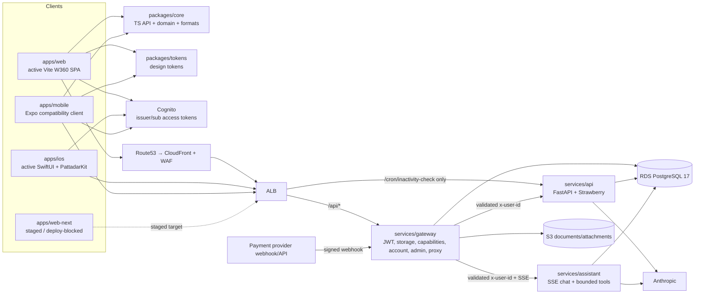
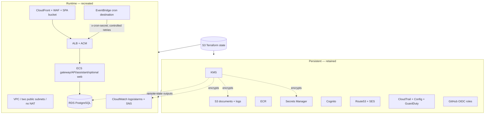

# Architecture

Declared Pattadar architecture from repository source, workflows, and Terraform.
It is **not proof of applied/live AWS state**; deployment, provider activation,
migrations, restore exercises, and alert delivery require separate evidence.

## System components and trust boundaries



`services/api` and `services/assistant` trust gateway-injected identity and must
not be generally internet reachable. The one direct API listener rule is the
cron endpoint, jointly protected by exact path routing and `CRON_SECRET`.

## Authentication and owner identity

```mermaid
sequenceDiagram
  participant C as Web/iOS/Expo
  participant I as Cognito
  participant G as Gateway
  participant A as API
  participant D as PostgreSQL
  C->>I: PKCE/native sign-in
  I-->>C: access token (iss, sub, client_id)
  C->>G: /api/gateway/pattadar/graphql + Bearer
  G->>G: strip all inbound identity headers
  G->>G: validate issuer, token_use, client_id, JWKS
  G->>G: derive immutable principal; apply reviewed legacy binding
  G->>A: request + x-user-id
  A->>D: owner-scoped query/mutation
  D-->>A: scoped rows
  A-->>G: response
  G-->>C: response
```

New identities use immutable issuer/subject. Existing DB/S3 owner keys remain
reachable only through reviewed `IDENTITY_LEGACY_BINDINGS`; neither gateway nor
API derives authority from the email local part.

## Durable AI work

Active web document reading submits a durable job and polls authenticated status.
The provider is called after durable claim and consent recheck; interruption is
persisted and the non-idempotent provider call is not automatically replayed.
Legacy synchronous extraction endpoints remain for older clients with a longer
proxy timeout and still no retries.

Assistant turns validate conversation/attachment ownership, apply domain policy,
claim an idempotent run, persist the user turn, stream bounded Claude SDK events,
and transactionally persist completion/failure. Only UI-tool results may emit
browser actions; public-record output is data and not title/identity proof.

## Persistent and runtime Terraform layers



Use `docs/runbooks/up-down.md` and the repository lifecycle scripts for operation;
never substitute targeted Terraform/state surgery. Platform down snapshots RDS
and may park document objects while persistent identity/keys/data/images/DNS
survive.

## Product domains

The API/W360 system owns portfolio/record 360, legacy land records, families and
beneficiaries, vault/documents, maps/FMB/village data, photos/features, service
orders/tickets, associate desk, wallet/payments, shares/capabilities,
notifications/cron, account consent/export/erasure, reference data/fees, and
audit. The assistant owns durable chat, bounded UI/read-only public-record tools,
attachments, and model-catalog consumption. Exact route ownership starts at
`apps/web/src/routes.tsx` and service entrypoints.

## Delivery and evidence

CI covers TypeScript, Python, Web360 browser wiring/maps, iOS vectors/parity/
Swift/simulator build, Terraform format/validation, and secret scanning. Deploy
promotes one exact successful main SHA, refuses web-next, consumes private
migration evidence, and writes a release receipt. Green CI or declared Terraform
does not prove production readiness or applied compliance controls.
