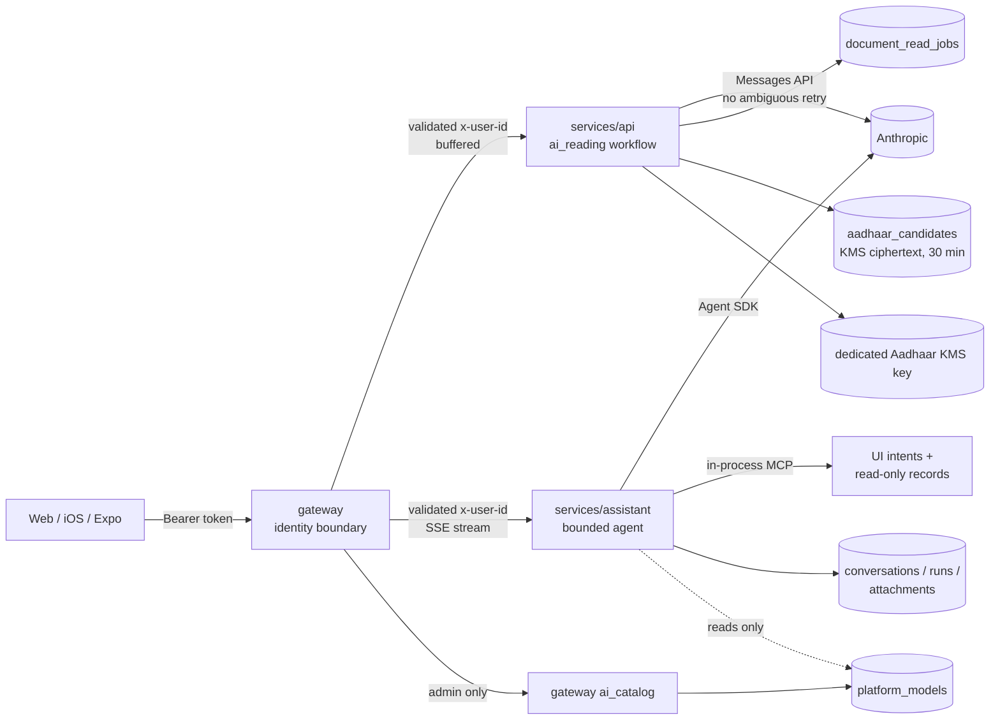

# Pattadar AI system

Where every piece of AI, agent, LLM, prompt, tool and model configuration lives,
and why it lives there. This is the human-readable companion to
[`ai-inventory.yaml`](./ai-inventory.yaml), which is the machine-readable index
checked by `scripts/ai-boundary-guard.py`.

This describes **implemented** architecture, not applied AWS state. Terraform in
this repository is a declaration; it is not evidence that anything is deployed.

## The one-paragraph version

Pattadar uses a model in exactly two ways. Interactive chat is an **agent**: it
picks tools in a loop, so it lives in `services/assistant` behind a deterministic
scope gate and an exact tool allowlist. Document reading is a **workflow**: one
bounded document plus one versioned prompt in, typed fields out, so it lives in
`services/api/src/ai_reading` behind a durable job queue that never re-issues a
paid call. Which models either may use is decided by the gateway-owned
`platform_models` catalog. Nothing else in the platform calls a model provider.

## Map

## Why two integrations instead of one

Current guidance is to use the simplest thing that works, reserve agents for
open-ended problems, and prefer predefined workflows where the task is
predictable ([Anthropic, *Building Effective AI Agents*](https://www.anthropic.com/engineering/building-effective-agents)).
Reading a deed is predictable; helping someone navigate their holdings is not.

The split is also a safety boundary. The two paths need different retry
semantics, and merging them would force one policy onto both:

| | Document reading | Conversational agent |
|---|---|---|
| Shape | workflow, one step | agent loop, bounded to 8 turns |
| Transport | Anthropic Messages API over httpx | Claude Agent SDK |
| Durability | `document_read_jobs`, authenticated status poll | per-conversation run claim in PostgreSQL |
| Retry | only faults where **no response was received** | none; a failed run is recorded |
| Tools | none | exact allowlist, built-ins denied |

## Where things are

### `services/api/src/ai_reading` — document reading

| File | Owns |
|---|---|
| `routes.py` | the five HTTP paths, nothing else |
| `operations.py` | the five read operations |
| `prompts.py` | every extraction prompt, verbatim |
| `usage.py` | prompt-cache marking, token classes, USD accounting |
| `config.py` | model id and cache floor |
| `consent.py` | the consent gate |
| `ports.py` | what the workflow depends on |
| `providers/anthropic.py` | **the only** provider call in this service |
| `jobs.py` | the durable queue and `document_read_jobs` table |

The queue deliberately stays outside the module: it owns a table and a worker
lifecycle, and `ai_reading.JOB_HANDLERS` is the whole contract between them.
Those handler names are written into queued rows, so renaming one orphans work
already in flight.

Prompts are Python constants rather than `.md` files on purpose. Prompt caching
keys on the exact bytes; moving them to files invites a reformat that silently
raises cost with no other visible symptom.

### `services/assistant` — the conversational agent

| Path | Owns |
|---|---|
| `src/main.py` | composition root **and** HTTP/SSE transport |
| `src/domain/scope_policy.py` | deterministic in/out-of-scope decision |
| `src/domain/tool_policy.py` | tool allowlist, denied built-ins, navigation allowlist, action validation |
| `src/domain/sse_events.py` | the published SSE event vocabulary |
| `src/ports.py` | agent runtime, model catalog and prompt seams |
| `src/adapters/agent_runtime.py` | Claude Agent SDK glue |
| `src/adapters/mcp/ui.py` | `pattadar_ui` MCP server (5 tools) |
| `src/adapters/mcp/records.py` | `pattadar_records` MCP server (8 read-only tools) |
| `src/adapters/model_catalog.py` | read-cache over `platform_models` |
| `src/adapters/prompt_repository.py` | system prompt: database → seed → built-in |
| `src/public_records/` | the read-only record corpus behind the record tools |
| `src/adapters/conversation_store.py`, `src/adapters/attachment_store.py` | durable run state and owner-scoped attachments |

Routes are **not** split out of `main.py`. The existing guard test asserts that
the scope gate runs before attachment reads, prompt loading and the model call
*in that file*. Splitting without equivalent route-level tests would delete that
guarantee rather than move it. That split is deferred, not rejected.

Policy is separated from the SDK because the three defences are independent:
which tools may be **called**, which paths may be **opened**, and which tool
results may become **browser commands**. A record whose text looks like an
action envelope can never move the browser, because only
`mcp__pattadar_ui__*` results are considered.

### `services/gateway/src/ai_catalog` — model administration

`routes.py` is the admin-only HTTP surface (fail closed) and `providers/` holds
one adapter per provider. `platform_models` is authoritative for every consumer.

`providers` (Python adapters) and `model_providers` (a SQL table of configured
provider rows) are different things with confusingly similar names.

## MCP

Both product MCP servers are **in-process** and created through the Agent SDK.
No product MCP server is exposed over a network, no remote MCP server is
configured, and `strict_mcp_config` plus an empty `setting_sources` stop the SDK
from picking up ambient configuration. This follows MCP guidance on least
privilege and keeping server authorization server-side
([MCP security best practices](https://modelcontextprotocol.io/docs/tutorials/security/security_best_practices)).

Separately, every `mcp.json` in this repository (`.kiro/`, `.cursor/`, `.codex/`,
`.gemini/`, root `.mcp.json`) configures **developer tooling only** — currently
just the local CodeGraph index. None of it is loaded by any running service.
`.kiro/**` is developer governance and is out of scope for product AI changes.

## Invariants

1. `services/api` trusts `x-user-id` and is reachable only through the gateway.
2. AI readings are durable async jobs with authenticated polling; an interrupted
   provider call is never automatically repeated.
3. A document that could not be read is an error, never `200` with empty fields.
4. An Aadhaar provider response may contain full digits only transiently inside
   the API process. Public responses and completed job results contain only
   `aadhaarMasked` plus an owner-scoped, one-use `aadhaarCandidateId`; provider
   raw text and unexpected fields are discarded. Persisted final digits are
   versioned direct-KMS ciphertext, and deed output remains masked.
5. The acres/cents rule reaches every prompt that extracts an extent.
6. Built-in SDK tools (shell, file, web, task) stay denied.
7. Public-record results are historical reference data, never proof of identity,
   ownership or current title.
8. An empty model catalog is an administrator decision and must produce a
   refusal, not a fallback.
9. Provider calls happen only in the two declared adapters.

## Known gaps

Recorded here rather than in prose elsewhere, so they stay visible. These are
**not** fixed by the current consolidation and need separate approval.

| Gap | Where | Risk |
|---|---|---|
| staged web-next still calls synchronous extraction | `apps/web-next` | a long read can exceed the 200s gateway ceiling |
| Aadhaar job source bytes remain temporarily in RDS | `services/api/src/ai_reading/jobs.py` | completed results are masked-only and source is nulled, but queued/running rows hold the card bytes until cleanup; an S3-reference queue is separate work |
| iOS treats `queued` as terminal, so an early poll reads as failure | `apps/ios/.../BackgroundRead.swift` | a successful read can surface as "nothing could be read" |
| Two web dialogs resubmit after an empty successful result | `PassbookCreateDialog.tsx`, `AddPropertyDialog.tsx` | a second paid call, contrary to invariant 2 |
| Commit-class UI actions rely partly on prompt and tool rules | `domain/tool_policy.py` | needs deterministic confirmation before any true mutation is wired |
| Assistant CI runs a selected subset, not the whole suite | `.github/workflows/ci.yml` | new assistant contracts can go unrun |

## Changing anything here

1. Update `ai-inventory.yaml` in the same change.
2. Run `python scripts/ai-boundary-guard.py`.
3. Run the owning service's tests:
   `services/api/tests/test_ai_reading.py`,
   `services/assistant/tests/test_tool_policy.py`,
   `services/gateway/tests`.
4. A new model, provider, prompt-behaviour change or client retry change is a
   reserved decision. Present evidence and wait for approval.

Service-wide file and package naming is in
[`service-layout.md`](./service-layout.md).

## Sources

- [Anthropic — Building Effective AI Agents](https://www.anthropic.com/engineering/building-effective-agents)
- [Anthropic — Writing Tools for AI Agents](https://www.anthropic.com/engineering/writing-tools-for-agents)
- [Anthropic — Effective Context Engineering for AI Agents](https://www.anthropic.com/engineering/effective-context-engineering-for-ai-agents)
- [Anthropic — Demystifying Evals for AI Agents](https://www.anthropic.com/engineering/demystifying-evals-for-ai-agents)
- [Model Context Protocol — Security Best Practices](https://modelcontextprotocol.io/docs/tutorials/security/security_best_practices)
- [NIST AI RMF: Generative AI Profile](https://www.nist.gov/publications/artificial-intelligence-risk-management-framework-generative-artificial-intelligence)

External-source content was rephrased for compliance with licensing restrictions.
