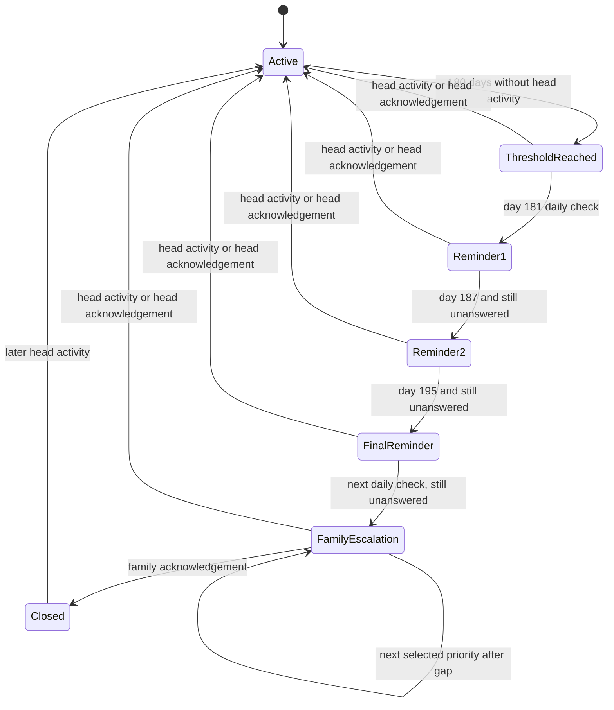
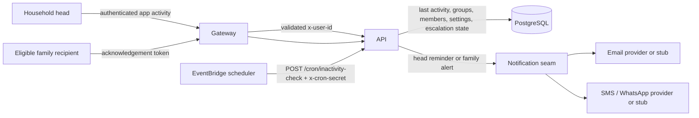

# Family and Household Management — Functional Design

**Date:** 19/09/2026
**Status:** Partially implemented in the working tree; not release-ready pending functional acceptance and rollout approval
**Document type:** Active feature design and implementation contract; source and completed checks remain authoritative
**Scope:** Family groups, head-of-household activity, inactivity reminders, family notifier settings, and household property management

## 1. Purpose

Pattadar should help a family keep its people, land, built property, and succession contacts well organised without silently granting access to sensitive records.

This design defines:

1. who is the head of a household;
2. how Pattadar records the head's last authenticated activity;
3. how the head is reminded after six months of inactivity;
4. how selected family members or all eligible members are notified if the head does not respond;
5. what the head can do with household properties; and
6. the safety, privacy, audit, and acceptance rules for the feature.

This document distinguishes implemented working-tree behavior from live or provider evidence. Executable source remains the authority, and this status does not mean the change is deployed or that a real recipient received a message.

## 2. Product principles

- **One accountable household head:** every family group has one accountable owner/head at a time.
- **Inactivity is not succession:** inactivity may trigger a welfare/continuity alert, but it must not transfer ownership, legal rights, or account authority.
- **Family records are not user accounts:** adding a family member does not automatically grant that person access to the household's records.
- **Least disclosure:** reminders and alerts contain only enough information to ask the recipient to check on the head. They must not include Aadhaar data, property details, document contents, or financial values.
- **Owner-scoped management:** household changes are authorised on the server, never only by hiding controls in the UI.
- **Consent-aware contact:** notification channels must respect verified contact information and applicable consent or opt-out settings.
- **Recoverable organisation:** deleting a family group must not delete the underlying land or built property.

## 3. Terminology

| Term | Meaning |
|---|---|
| **Family group / household** | A Pattadar group with `type='family'`. |
| **Head of household** | The authenticated owner of the family group. The current model represents this as `groups.owner_user_id` and a per-group self member with role `Head`. |
| **Member** | A person recorded in the household. A member may be a beneficiary/heir but is not necessarily an authenticated Pattadar user. |
| **Eligible notifier** | A non-self adult household member with a verified email and active purpose-specific safeguard-email consent. |
| **Selected notifier** | An eligible notifier explicitly placed in the household's ordered notification list. |
| **Last active** | The latest server-recorded authenticated activity for the head. This is broader than an identity-provider login event. |
| **Acknowledgement** | A valid response proving that the alert was received and stopping the current escalation cycle. |
| **Holding** | Agricultural land represented by passbooks/parcels, or built property represented by a property record. |

## 4. Scope

### 4.1 In scope

- Create, rename, view, and delete a family group.
- Maintain one head and family member records.
- Display the head's last active time in DD/MM/YYYY format.
- Detect six months of head inactivity.
- Send three staged reminders to the head at day 1, day 7, and day 15 after the inactivity threshold.
- Mark the day-15 message as the final reminder.
- Stop reminders when the head becomes active or acknowledges.
- Configure either all eligible family members or an ordered list of specific notifiers.
- Escalate to family after the final head reminder remains unanswered.
- Let the head add, edit, remove, assign, and unassign household holdings.
- Record auditable family, notifier, and holding-management events.

### 4.2 Out of scope

- Automatic transfer of ownership or headship.
- Legal determination of heirs or succession rights.
- Allowing a family member to manage another person's account solely because they are listed as a member.
- Joint approval, power-of-attorney, guardian, executor, or emergency-access workflows.
- Provider activation, production deployment, migration, or live notification delivery.
- Automatic deletion of property when a family group is deleted.

## 5. Current repository behavior

| Capability | Current behavior | Status against this design |
|---|---|---|
| Household head | Family group creator is stored as `owner_user_id`; their self member receives role `Head`. | Implemented foundation. There is no separate `head_of_household` or previous-head history field. |
| Last activity | The authenticated `me` query updates `users.last_active_at` and returns the prior value. | Implemented as an activity heartbeat, not an exact Cognito login timestamp. |
| Inactivity threshold | Default threshold is 180 elapsed days. The engine sends one head stage per due run on days 181, 187, and 195, then begins family escalation on a later daily run. | Implemented in the working tree; delivery verification remains pending. |
| Head acknowledgement | A 30-day, single-purpose, hashed-at-rest capability closes the cycle and updates head activity only for a head token. | Implemented in the working tree. |
| Default family notification | With no ordered notifier rows, all eligible non-self members with verified email are emailed. Missing contacts are reported as skipped rather than delivered. | Implemented in the working tree. |
| Specific notifiers | The head can atomically save an ordered list of same-household, non-self members with verified email. Priorities are contacted one at a time. | Implemented in the working tree; email is the only enabled inactivity channel. |
| Notification preferences | Head reminders require `email` in the account's general `notification_prefs` and the purpose-specific `inactivity_email_enabled` flag. Family delivery requires a verified email plus explicit `inactivity_email_consent`. The acknowledgement page can withdraw only future safeguard email. | Implemented in the working tree; live acceptance remains pending. |
| Family/member management | Owner-scoped group and member create/update/remove operations exist. | Implemented foundation. |
| Property management | Owner-scoped property/passbook/parcel create, update, delete, assignment, and stake operations exist. | Implemented foundation. There is no delegated non-owner household manager. |
| Group deletion | Members are removed and holdings are returned to personal/unassigned scope rather than deleted. | Implemented and retained by this design. |

## 6. Actors and authority

| Actor | View household | Manage members | Configure notifiers | Manage household holdings | Receive alerts |
|---|---:|---:|---:|---:|---:|
| Authenticated household head/owner | Yes | Yes | Yes | Yes | Yes |
| Recorded family member without account authority | No account access by default | No | No | No | Yes, if eligible |
| Invited/verified member | Only if a separate access grant is implemented | No by this design | No | No | Yes, if eligible |
| Scheduler | No interactive access | No | No | No | Initiates the server-side inactivity check through the secret-guarded cron route |
| Pattadar operator/admin | No implied access to owner records | No implied authority | No implied authority | No implied authority | Operational delivery evidence only, subject to separate controls |

### 6.1 Head-of-household rule

Each family group has exactly one active head: its authenticated owner. A displayed member role of `Head` is descriptive and must not be used as the only authorisation check.

Changing the head is a separate, high-risk account-ownership workflow and is not authorised by this design. Inactivity, reminder exhaustion, or family acknowledgement must never change `owner_user_id`.

## 7. Functional requirements

### 7.1 Household and member management

- **FM-001:** The head can create a family group with a name and optional description.
- **FM-002:** Pattadar creates one non-removable self member for the head in each family group.
- **FM-003:** The head can add, edit, and remove non-self members.
- **FM-004:** Member records may include relationship, role, contact information, family links, beneficiary/heir status, and share information.
- **FM-005:** Adding a member must not grant login or record access.
- **FM-006:** Removing a member must also remove that member from the notifier order and safely clear family-tree references.
- **FM-007:** The UI must clearly distinguish the household head, members, beneficiaries/heirs, pending invitations, and verified contacts.
- **FM-008:** Sensitive identifier values must remain masked. Full Aadhaar numbers must never appear in a member list, notification, log, error, or this design's audit evidence.

### 7.2 Head activity

- **HA-001:** Pattadar records server-side authenticated activity for the household head.
- **HA-002:** The UI labels this value **Last active**, not **Last login**, unless an identity-provider login event is separately integrated and proven.
- **HA-003:** Activity from an unauthenticated request, a family recipient clicking a family alert, or a background scheduler must not count as head activity.
- **HA-004:** A valid head acknowledgement counts as activity and resets the inactivity cycle.
- **HA-005:** Missing or invalid activity data fails safe: it must not trigger family escalation without evidence of six months of inactivity.
- **HA-006:** Dates shown to users use DD/MM/YYYY. Internal timestamps may remain ISO-8601 UTC.

### 7.3 Six-month reminder schedule

For this draft, **six months means 180 elapsed days** from the last authenticated head activity. The requested day 1/7/15 reminders are offsets after that threshold.

| Inactivity age | Action | Message intent |
|---|---|---|
| Less than 180 days | No inactivity reminder. | None. |
| 180 days + 1 day | Send reminder 1 to the head. | "Please confirm that you are active." |
| 180 days + 7 days | Send reminder 2 if no activity or acknowledgement occurred. | "We still have not received a response." |
| 180 days + 15 days | Send reminder 3 to the head, clearly marked **Final reminder**. | "Family notification will follow if there is no response." |
| On the next daily check after the final reminder remains unanswered | Start family escalation using the configured notifier mode. | "Please check on the household head." |

- **IR-001:** Each scheduled reminder is sent at most once per inactivity cycle.
- **IR-002:** A late scheduler run sends only the next required stage; it must not burst all missed reminders in one run.
- **IR-003:** Any valid head activity or acknowledgement stops pending reminders and family escalation.
- **IR-004:** A new inactivity cycle may begin only after activity reset followed by a new 180-day inactive period.
- **IR-005:** The final reminder must explicitly state that it is final and explain that configured family contacts will be notified next.
- **IR-006:** Provider or network failure must be recorded. A state must not be marked delivered merely because an attempt was made.
- **IR-007:** Retries must be idempotent by cycle, stage, recipient, and channel so a scheduler retry cannot produce duplicate messages.

### 7.4 Family notifier settings

The household settings screen offers two mutually exclusive modes:

1. **Notify all eligible family members together** — the default when no selected list is saved.
2. **Notify selected family members in order** — Priority 1 first, then the next priority after the configured gap if no acknowledgement is received.

- **NT-001:** Only the head can change notifier settings.
- **NT-002:** The head can add, remove, and reorder selected notifiers.
- **NT-003:** The UI shows each selected person's name, relationship, priority, available verified channels, and whether contact is usable.
- **NT-004:** A self member or minor cannot be selected as a family escalation recipient.
- **NT-005:** Duplicate recipients are rejected.
- **NT-006:** A member from another household cannot be selected.
- **NT-007:** Removing a member from the household removes them from notifier settings.
- **NT-008:** In all-members mode, Pattadar emails every eligible non-self member with a valid, consented email address.
- **NT-009:** Members without a usable email are skipped for the email-all action and shown to the head as needing contact details; the send summary must not claim they were notified.
- **NT-010:** SMS or WhatsApp may be used only when the relevant channel is configured and consented. Email-all must not silently become a phone broadcast.
- **NT-011:** Selected-notifier mode may store a channel selection per notifier. If no channel is selected, use the recipient's first verified and consented channel according to product policy.
- **NT-012:** Saving an empty selected list returns the household to all-members mode; the UI must state this consequence before saving.
- **NT-013:** Family acknowledgement stops further priorities for that cycle but does not reset the head's last-active value or transfer authority.

### 7.5 Property and holding management

- **PM-001:** The authenticated household head can add agricultural land and built property to their owner scope and assign it to a family group.
- **PM-002:** The head can edit, organise, and remove holdings that they own.
- **PM-003:** The head can assign or unassign a passbook/property between personal and family-group views without changing legal ownership.
- **PM-004:** The head can record the account's relationship to a holding as owned, managed, or watched where supported.
- **PM-005:** Deleting a family group unassigns its holdings to personal scope; it must not delete those holdings.
- **PM-006:** Deleting a property, parcel, or passbook is a separate explicit action with confirmation and owner-scoped server authorisation.
- **PM-007:** A family member cannot add, edit, reassign, or delete the head's holdings unless a separate delegated-authority feature is reviewed and implemented.
- **PM-008:** Property changes produce audit events that identify the action and record identifier without putting sensitive document content in logs.

## 8. Inactivity workflow

A family acknowledgement closes notifications for the current cycle but is not proof that the head logged in. The UI and audit trail must preserve that distinction.

## 9. Architecture and data flow

Security boundaries:

- Normal client traffic reaches the API only through the gateway, which validates identity and injects `x-user-id`.
- `/cron/inactivity-check` is the only direct API route in this flow and must remain protected by exact path routing and `CRON_SECRET`.
- The provider seam may be configured as a stub. Repository configuration or a successful local call is not proof of live email/SMS/WhatsApp delivery.
- Acknowledgement tokens must be unguessable, single-purpose, revocable/expiring according to the approved token policy, and limited to closing an inactivity stage.

## 10. Implemented data and contract evolution

The working-tree implementation reuses current tables and adds durable safeguard state. These statements describe repository code, not an applied database migration or deployed service.

### 10.1 Existing data retained

- `groups.owner_user_id` as the server-side head authority.
- The family self member with role `Head` for display and family-tree purposes.
- `users.last_active_at` as the authenticated activity heartbeat.
- `family_notifiers` as the household's selected notifier order.
- `inactivity_escalations` as durable cycle/stage state.
- `notification_log` as delivery-attempt evidence.

### 10.2 Additive working-tree schema

- `inactivity_escalations` carries cycle, threshold, next-action, outcome, and separate head/family acknowledgement timestamps.
- `inactivity_capabilities` stores only token hashes and binds each capability to a cycle, stage, actor type, recipient reference, expiry, and one-time consumption.
- `inactivity_deliveries` records cycle/stage/recipient/channel attempts with a unique delivery key, provider, status, bounded error code, and attempt count.
- `family_notifiers.channel` is additive and currently restricted by application behavior to `email`.
- `GroupType` exposes head name, last activity, stage, next action, last outcome, and contact-gap count for the active web screen.
- Existing legacy escalation rows are assigned to the current activity-derived cycle when next evaluated; no live backfill has been run.

### 10.3 API behavior

The root GraphQL contracts remain additive. `notifiers` now exposes channel and eligibility fields; `setNotifiers` preserves the empty-list compatibility contract while validating the full replacement transactionally; `acknowledgeInactivity` keeps its Boolean response but now consumes a purpose-bound public capability. Active W360 selects the new group status fields. Native iOS does not currently consume these inactivity operations, so this root-schema change is classified NOTE rather than an automatic Swift adaptation.

The UI needs read models for:

- current head and last active value;
- current inactivity stage and next scheduled action;
- notifier mode;
- selected priority order and channel state;
- contact gaps preventing delivery; and
- most recent reminder/escalation outcome without exposing message contents unnecessarily.

## 11. User experience

### 11.1 Household overview

Show:

- household name and head;
- member and holding counts;
- last active date for the head;
- inactivity safeguard status: Active, Reminder due, Awaiting response, Family escalation, or Closed;
- a plain-language explanation that alerts do not transfer control; and
- actions for members, notifier settings, and holdings.

### 11.2 Notifier settings

The settings dialog must provide:

- a clear all-members versus selected-order choice;
- drag/reorder or accessible move-up/move-down controls;
- channel and verification status;
- warnings for missing or unusable contact details;
- a preview of the reminder/escalation order without exposing sensitive records; and
- explicit save confirmation.

### 11.3 Property management

The head should be able to:

- add land or built property;
- edit property details;
- assign it to the household;
- return it to personal scope;
- view the household's holdings through the full property-management surface; and
- delete a holding only through a separate confirmed action.

The UI must not imply that assignment to a family group changes title or legal ownership.

## 12. Notification content rules

Head reminders may include:

- Pattadar product name;
- household name where useful;
- reminder stage, including **Final reminder**;
- a secure acknowledgement link; and
- a short explanation of what happens next.

Family alerts may include:

- the household name;
- a statement that the head has not responded to Pattadar's activity reminders;
- a request to check on the head; and
- a secure acknowledgement link.

Notifications must not include:

- Aadhaar numbers or images;
- dates of birth;
- phone numbers or email addresses of other members;
- property addresses, survey numbers, values, shares, or document contents;
- login credentials or reusable account links; or
- a claim that ownership, inheritance, or account control has changed.

## 13. Failure and edge cases

- **No eligible family recipients:** keep the escalation open, record that no recipient was available, and show the head a setup warning when they next become active.
- **Some all-mode emails missing:** send to eligible addresses, record skipped members, and report partial—not complete—delivery.
- **Member removed during escalation:** do not send future stages to that member; recompute the remaining ordered recipients safely.
- **Notifier contact changed:** use the current verified/consented contact at send time while retaining non-sensitive delivery evidence.
- **Head active exactly at scheduler time:** activity update and scheduler processing must resolve transactionally or conservatively in favour of not escalating.
- **Repeated scheduler call:** unique stage delivery keys prevent duplicate messages.
- **Provider failure:** log failure without secrets or full sensitive payloads; retry under bounded idempotent policy.
- **Group deleted:** close its open inactivity cycle and unassign holdings without deleting them.
- **Multiple family groups owned by one user:** each group has separate notifier settings and escalation state; one authenticated activity heartbeat applies to the shared head account.

## 14. Audit and observability

Audit events should cover:

- family group create, update, and delete;
- member add, update, remove, invite, and verification;
- notifier mode/order/channel changes;
- holding create, update, assignment, unassignment, and delete;
- inactivity stage transition;
- acknowledgement type without embedding the token; and
- notification attempted, sent/logged, failed, or skipped.

Operational metrics should include counts of due cycles, reminders attempted, family escalations, provider failures, skipped recipients, and acknowledgements. Metrics and logs must not contain Aadhaar data, document content, private inventories, tokens, or unnecessary contact identifiers.

## 15. Security and privacy requirements

- Server-side owner checks remain mandatory for every group, member, notifier, and holding mutation.
- The API must remain unreachable to ordinary clients except through the gateway.
- The cron route must fail closed when `CRON_SECRET` is absent or incorrect outside explicitly insecure local development.
- Contact details, relationship data, inactivity history, and notification logs are personal data and follow account access, retention, export, and erasure policy.
- Minor/guardian records require the separately tracked verifiable-consent work before being represented as fully compliant.
- Per-channel consent and opt-out must be enforced by the inactivity engine before this target feature is accepted. Merely storing `notification_prefs` is insufficient.
- Family alert acknowledgement grants no property or account access.
- Provider credentials and message delivery are operational/provider-activation concerns and are not approved by this design.

## 16. Functional acceptance scenarios

| ID | Scenario | Expected result |
|---|---|---|
| FA-01 | Head is active within 180 days. | No inactivity message is created. |
| FA-02 | Head reaches day 181 with no response. | Exactly one first reminder is recorded for the head. |
| FA-03 | Head remains inactive through days 187 and 195. | Exactly one second reminder and one final reminder are sent at their stages; final copy is clearly marked. |
| FA-04 | Scheduler runs twice for the same stage. | No duplicate recipient/channel delivery is created. |
| FA-05 | Head logs in or acknowledges after reminder 1. | Remaining stages are cancelled and the cycle resets. |
| FA-06 | Final reminder remains unanswered; no selected notifier order exists. | On the next daily check, every eligible non-self member with consented email is emailed once; ineligible members are reported as skipped. |
| FA-07 | Selected order contains three eligible members. | Priority 1 is notified first; later priorities occur only after the approved gap and no acknowledgement. |
| FA-08 | A family recipient acknowledges. | Further family priorities stop; head authority and last-active history are not falsely changed. |
| FA-09 | A cross-household member ID is submitted to notifier settings. | Mutation is rejected with no partial settings change. |
| FA-10 | A non-head attempts member, notifier, or holding mutation. | Server rejects the operation. |
| FA-11 | Head creates, edits, assigns, unassigns, and deletes a test holding. | Each operation succeeds only in owner scope and creates the expected audit evidence. |
| FA-12 | Head deletes a family group containing holdings. | Group/member configuration is removed or closed; holdings remain and return to personal scope. |
| FA-13 | Cron request omits or supplies the wrong secret. | Request is denied and no inactivity state changes. |
| FA-14 | Notification provider is in stub mode. | Attempt is recorded as stub/logged and is not represented as real-world delivery. |
| FA-15 | Notification content is inspected. | No Aadhaar, property detail, document content, token leakage, or unnecessary PII is present. |

Because holdings and household settings are data-mutating surfaces, implementation acceptance must exercise create, read, update, delete/clear, assignment, acknowledgement, and failure paths end to end against disposable test data. Typecheck or an empty-state screenshot alone is not functional proof.

## 17. Delivery sequence

1. **Policy confirmation:** approve the 180-day interpretation, day 1/7/15 offsets, post-final escalation timing, channel policy, and acknowledgement semantics.
2. **Backend state machine:** evolve durable cycle/stage data and idempotent transition logic.
3. **Consent-aware delivery:** connect verified channels and notification preferences to the engine.
4. **GraphQL contracts:** add the minimum status/settings fields while preserving active clients.
5. **Active web UI:** implement status and settings in `apps/web` W360 first.
6. **Cross-client assessment:** evaluate Expo and native iOS parity before release.
7. **Functional acceptance:** exercise complete household, notifier, reminder, acknowledgement, and holding-management paths with failure cases.
8. **Runbook/architecture/privacy updates:** update active docs after executable behavior changes.
9. **Provider activation and production release:** separate approval and evidence gates; not part of this document's implementation approval.

## 18. Decisions requiring Reddy approval

| Decision | Recommended default | Alternatives / trade-off |
|---|---|---|
| Meaning of six months | 180 elapsed days | Calendar-month arithmetic is more human-readable but less deterministic across month lengths. |
| Reminder offsets | Day 1, day 7, day 15 after reaching 180 days | Existing 150-day early check-in could be retained, but it differs from the requested policy. |
| Family escalation time | Next daily check after the day-15 final reminder | Same-run escalation is faster but undermines the meaning of a final opportunity to respond. |
| Default family mode | Email all eligible non-self members | Current auto-routing can also use phone; broader reach increases consent and message-cost complexity. |
| Selected priority gap | Seven days | A shorter gap responds faster; a longer gap reduces unnecessary disclosure. |
| Head count | One owner/head per household | Co-heads require a new authority, conflict, and succession model. |
| Delegated property management | Not in this scope | Useful for trusted family representatives, but requires explicit grants, revocation, audit, and legal/product review. |
| Exact last-login tracking | Continue using authenticated last-active heartbeat and label it honestly | Cognito login-event integration provides exact login semantics but adds identity-provider coupling and operational work. |

Approval of this draft authorises planning only. It does not authorise production/provider changes, data migration, delegated access, or a change of household ownership.

## 19. Repository evidence

Current behavior was traced to:

- [`services/api/src/main.py`](../../services/api/src/main.py): `GROUP_TYPES`, `Query.me`, `Query.notifiers`, `_inactivity_cfg`, `_run_inactivity_check`, group/member/notifier/holding mutations, schema tables, and `/cron/inactivity-check`.
- [`services/api/src/notify.py`](../../services/api/src/notify.py): email, SMS, WhatsApp, stub logging, and contact auto-routing.
- [`apps/web/src/w360/pages/Groups.tsx`](../../apps/web/src/w360/pages/Groups.tsx): household detail, inactivity explanation, and notifier-priority UI.
- [`apps/web/src/pages/families/familiesData.ts`](../../apps/web/src/pages/families/familiesData.ts): family/notifier/property-assignment GraphQL calls.
- [`apps/web/src/data/pattadarActions.ts`](../../apps/web/src/data/pattadarActions.ts): holding create/delete and stake operations used by the web client.
- [`docs/architecture.md`](../architecture.md): declared gateway/API/cron trust boundaries.
- [`docs/compliance/gdpr-dpdp.md`](../compliance/gdpr-dpdp.md): family, inactivity, contact, notification, minor/guardian, retention, and consent data classes.

## 20. Remaining rollout and evidence gap

The working-tree flow separates contact verification from purpose-specific safeguard-email consent. Membership verification offers an optional consent control for adult members; minors are never safeguard recipients, and guardian-contact changes revoke and reissue pending credentials. Family delivery requires verification and consent at send time; changing the effective invite contact revokes the old credential and clears affected verification/consent; and a recipient can acknowledge while withdrawing only future safeguard email. Ambiguous provider outcomes enter a terminal `delivery_attention` state and are never retried automatically. No resolution mutation exists because deciding whether an ambiguous external side effect may be retried is an operator policy reserved for Reddy; the rollout gate must remain off until that reviewed workflow exists. This is executable design, not legal advice or production evidence.

`INACTIVITY_V2_ENABLED=1` is an explicit rollout gate. Keep it unset while old and new API tasks coexist; the new resolver can consume bounded legacy links, but new capability links must not be emitted until every running task understands them. Enabling the flag, applying schema changes to an environment, activating providers, or dispatching the scheduler requires separate Reddy approval and rollout evidence.

No provider was activated and no cloud, live-data, migration, scheduler, or production operation was performed as part of this implementation.
